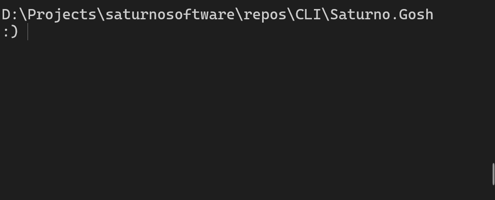

<p align="center">
    
</p>


<p align="center">
    <a href="https://github.com/SaturnoSoftware/gosh/releases"></a>
    <a href="https://github.com/SaturnoSoftware/gosh/commits"></a>
    <a href="./LICENSE"></a>
    <a href="./tests"></a>
    <a href="https://github.com/SaturnoSoftware/gosh"></a>
</p>

<p align="center">
  <b>Jump between directories in seconds.</b> Lightweight bookmarks for your shell.
  <br>
  <br>
</p>


**gosh** is a simple CLI bookmark utility that lets you jump between frequently used directories quickly. It reduces the stress of traversing long, nested paths or places that you reference often.

It works as a lightweight CLI companion powered by Python, with hooks in Bash and PowerShell.

Maintained by [Saturno.Software](https://saturno.software/).

---

## Quick Start

<p align="center">
    
</p>


```bash
git clone https://github.com/SaturnoSoftware/gosh
cd gosh

./install.sh   # if you are in bash
./install.ps1  # if you are in powershell

# Add a bookmark
gosh -a myproject ~/Projects/myproject

# Jump to it from anywhere
gosh myproject
```

---

## Features

- **Directory Bookmarks** — Save and jump to frequently used paths instantly
- **Cross-Shell** — Works in Bash and PowerShell
- **Lightweight** — Python-based core, minimal footprint
- **CRUD Operations** — Add, update, delete, and list bookmarks
- **Path Lookup** — Check if a path already has a bookmark
- **JSON Metadata** — Machine-readable CLI metadata contract
- **Cross-Platform** — macOS, Linux, Windows support
- **Auto-Migration** — Migrates legacy bookmark data on first run
- **Zero Dependencies** — Only requires Python 3

---

## Installation

### From Source
```bash
git clone https://github.com/SaturnoSoftware/gosh
cd gosh

./install.sh   # bash
./install.ps1  # powershell
```

### From a Packaged Release
The same install scripts also work from a packaged release root under `__DIST/<release-name>/`.

### Requirements
- Python 3
- Bash or PowerShell

### Install Location

```text
~/.saturnosoftware/gosh/
  package.json
  bin/
    gosh2.py
    gosh.sh
    gosh.ps1
  config/
  data/
    gosh-paths.txt
```

---

## Usage

```
Usage:
  gosh                   (Same as gosh -l)
  gosh <name>            (To change the directory)
  gosh -h | -v | -Json   (Show help | version | JSON metadata)
  gosh -l | -L           (Show list of bookmarks)
  gosh -p <name>         (Show path for bookmark)
  gosh -e <path>         (Show bookmark for path)
  gosh -a <name> <path>  (Add bookmark)
  gosh -u <name> <path>  (Update bookmark path)
  gosh -d <name>         (Delete the bookmark)

Options:
  *-h --help     : Show this screen.
  *-v --version  : Show app version and copyright.
  *-Json --json  : Print structured CLI metadata for help/version consumers.

  *-e --exists <path>  : Print the Bookmark for path.
  *-p --print  <name>  : Print the path of Bookmark.

  *-l --list       : Show all Bookmarks (no Paths).
  *-L --list-long  : Show all Bookmarks and Paths.

  *-a --add    <name> <path>  : Add a Bookmark with specified path.
  *-u --update <name> <path>  : Update the path for a Bookmark.
  *-d --delete <name>         : Delete a Bookmark.

Notes:
  If <path> is blank the current directory is assumed.

  Options marked with * are exclusive, i.e. gosh will run that
  and exit after the operation.
```

---

## Common Tasks

### Add a Bookmark
```bash
# Bookmark the current directory
gosh -a work

# Bookmark a specific path
gosh -a docs ~/Documents/project-docs
```

### Jump to a Bookmark
```bash
gosh work
gosh docs
```

### List All Bookmarks
```bash
gosh -l        # names only
gosh -L        # names and paths
```

### Update or Remove a Bookmark
```bash
gosh -u work ~/new/path
gosh -d old-bookmark
```

### Check if a Path Has a Bookmark
```bash
gosh -e ~/Projects/myproject
```

---

## Contributing

Contributions welcome! Please:
- Follow existing code style
- Add tests for new features
- Submit pull requests against `main`

---

## License

GPLv3 — See [LICENSE](./LICENSE) for details.

Maintained by [Saturno.Software](https://saturno.software/)

---

## FAQ

**Q: Does gosh work on Windows?**  
A: Yes! Use the PowerShell hook (`gosh.ps1`) for full support.

**Q: Can I use gosh in scripts?**  
A: Yes. Use `gosh -p <name>` to get the path without changing directory — ideal for scripting.

**Q: Does it require root/admin?**  
A: No. Everything installs under your home directory.

---

## Links

- [GitHub Repository](https://github.com/SaturnoSoftware/gosh)
- [Saturno.Software](https://saturno.software/)

---


<p align="center">
  <b>Made with ❤️ by Saturno.Software</b>
</p>
